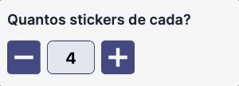

# Desafio front-end

##Primeira parte: colocando ordem na casa.

Precisamos deixar o HTML semântico, use as tags HTML que correspondem corretamente aos cenários aplicados.
Fique a vontade para mudar a estrutura caso ache necessário, mas precisa ser fiel ao layout.
Na tag <html>, está faltando um parâmetro que é obrigatório. Você consegue identificar e aplicar?

##Segunda parte: tornando a casa acessível.
Vixe!scream Parece que o HTML não está totalmente acessível. Você consegue melhorar a acessibilidade?

##Terceira parte: o contador de stickers.
Precisamos fazer o componente de contador funcionar para que o usuário possa definir a quantidade de stickers que deseja comprar.

##Bonus: Vamos validar o formulário?!
Validações de formulário ajudam o usuário a não se perder durante o preenchimento das informações necessárias. Ajude nessa causa upside_down_face.

Link do desafio: 

Link do resultado: 

